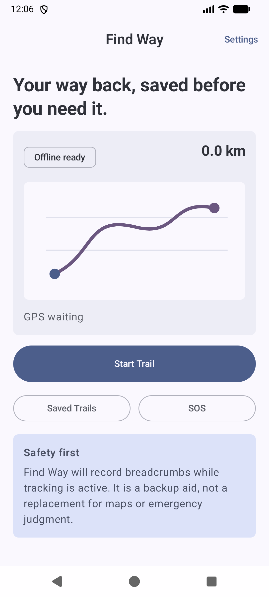
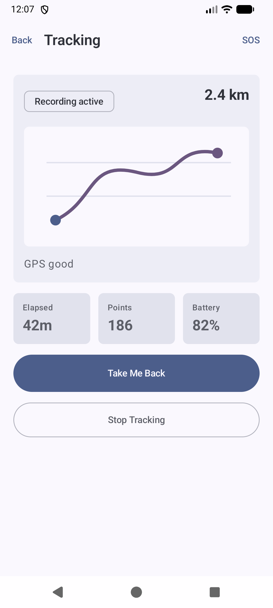

# Find Way

Find Way is an Android outdoor-safety app designed to help hikers, campers, travelers, and field workers retrace a recorded route when they lose their bearings.

The core product promise is simple:

> Start tracking before you go. If you get lost, follow your saved breadcrumbs back.

Find Way is intended to be an offline-first safety aid with a calm, readable interface that remains useful when connectivity is unavailable and the user is under stress.

## Screenshots

<table>
  <tr>
    <td align="center"><br /><strong>Home</strong></td>
    <td align="center"><br /><strong>Active tracking</strong></td>
  </tr>
</table>

## Project Status

Find Way is currently in the **application foundation and UI prototype stage**.

Implemented:

- Native Android project using Kotlin and Jetpack Compose
- Material 3 outdoor-safety design system
- Single-activity, edge-to-edge application
- Type-safe, saveable Navigation 3 routes
- Home, Tracking, Return Mode, Saved Trails, Trail Detail, SOS, and Settings screens
- Initial breadcrumb route visualization
- Pure Kotlin return-progress calculation
- Unit and instrumented Compose tests
- Successful build, launch, and test verification on an Android emulator

Not implemented yet:

- Live GPS collection
- Foreground location service
- Runtime location permission flow
- Room persistence for trails and breadcrumbs
- Real map or offline map rendering
- Sensor-based compass heading
- Production SOS sharing and emergency calling

The current screens contain representative data while the tracking infrastructure is developed.

## Product Goals

1. Record a user's route as a sequence of reliable GPS breadcrumbs.
2. Continue recording while the screen is off through a visible foreground service.
3. Reverse the recorded route and guide the user toward the next breadcrumb.
4. Warn the user when they drift too far from the saved path.
5. Preserve the core tracking and return experience without internet access.
6. Communicate GPS accuracy, battery state, and safety limitations clearly.

Find Way is a navigation aid, not a replacement for emergency services, prepared route planning, physical maps, or sound outdoor judgment.

## Technology

- **Language:** Kotlin 2.3
- **UI:** Jetpack Compose with Material 3
- **Navigation:** Jetpack Navigation 3 with serializable `NavKey` routes
- **Architecture direction:** UI, domain, and data layers with unidirectional data flow
- **Asynchronous work:** Kotlin Coroutines and Flow
- **Build system:** Gradle 9.1 with Android Gradle Plugin 9
- **Android SDK:** compile/target SDK 36, minimum SDK 24
- **Java:** Java 17 source compatibility using JDK 21 toolchain
- **Testing:** JUnit 4 and Android Compose UI testing

Planned platform components include Room, DataStore, Hilt, Fused Location Provider, and an Android location foreground service.

## Current Navigation

```text
Home
|-- Tracking
|   |-- Return Mode
|   `-- SOS
|-- Saved Trails
|   `-- Trail Detail
|       `-- Return Mode
|-- SOS
`-- Settings
```

Navigation state uses `rememberNavBackStack`, allowing the back stack to survive configuration changes. Destinations are represented by typed, serializable navigation keys instead of route strings.

## Architecture Direction

```text
Compose Screen
    |
Screen ViewModel / UI State
    |
Domain Use Cases
    |
Repositories
    |
Room | Location Provider | Sensors | DataStore
```

The application will follow these principles:

- A single source of truth for active and saved trails
- Immutable UI state exposed with `StateFlow`
- Lifecycle-aware state collection in Compose
- Platform APIs hidden behind interfaces and repositories
- Pure Kotlin route calculations where possible
- Fakes instead of mocks for most tests
- Foreground-only location permission plus a location foreground service for active tracking

## Project Structure

```text
app/src/main/java/com/example/findway/
|-- MainActivity.kt              # Single Android activity
|-- Navigation.kt                # Navigation 3 graph and destination wiring
|-- NavigationKeys.kt            # Typed navigation keys
|-- domain/
|   `-- TrailProgress.kt         # Breadcrumb return-progress logic
|-- theme/                       # Material 3 colors, typography, and theme
`-- ui/screens/
    `-- AppScreens.kt            # Current Compose screen prototypes

app/src/test/                    # Local JVM unit tests
app/src/androidTest/             # Emulator/device Compose tests
```

The screen file will be separated into feature packages as each feature gains state, ViewModels, repositories, and production behavior.

## Getting Started

### Requirements

- Android Studio with JDK 21
- Android SDK 36
- An emulator or Android device running API 24 or newer

Clone the repository:

```bash
git clone https://github.com/himu-gupta/find-way.git
cd find-way
```

Open the project in Android Studio and allow Gradle sync to complete.

Build the debug APK:

```bash
./gradlew :app:assembleDebug
```

The APK is generated at:

```text
app/build/outputs/apk/debug/app-debug.apk
```

## Testing

Run local unit tests:

```bash
./gradlew :app:testDebugUnitTest
```

Run the build and local tests together:

```bash
./gradlew :app:assembleDebug :app:testDebugUnitTest
```

With an emulator or device running, execute instrumented Compose tests:

```bash
./gradlew :app:connectedDebugAndroidTest
```

Current coverage includes:

- Empty-route return behavior
- Selecting the previous breadcrumb from the end of a recorded route
- Off-route threshold detection
- Presence of the Home screen's primary safety actions

## Development Roadmap

### Phase 1: Foundation

- [x] Compose project and theme
- [x] Navigation 3 app shell
- [x] Core screen prototypes
- [x] Initial unit and Compose tests
- [ ] Split screens into feature packages
- [ ] Add Hilt dependency injection

### Phase 2: Trail Storage

- [ ] Define trail, breadcrumb, and marker models
- [ ] Add Room database and DAOs
- [ ] Add repository interfaces and in-memory test fakes
- [ ] Persist active and completed trails

### Phase 3: Location Recording

- [ ] Add location permission education and requests
- [ ] Integrate Fused Location Provider
- [ ] Add a location foreground service and persistent notification
- [ ] Filter inaccurate and duplicate points
- [ ] Add battery-aware recording profiles

### Phase 4: Return Guidance

- [ ] Connect return progress to live location
- [ ] Add compass and bearing guidance
- [ ] Render the recorded route and current position
- [ ] Add off-route vibration and sound alerts
- [ ] Handle weak, approximate, and unavailable GPS states

### Phase 5: Safety and Release Readiness

- [ ] Implement coordinate sharing and emergency call intents
- [ ] Add GPX import/export
- [ ] Add accessibility and adaptive-layout testing
- [ ] Add database, service, navigation, and end-to-end tests
- [ ] Validate battery usage and long-running recording on physical devices
- [ ] Prepare privacy disclosures and Google Play foreground-service declarations

## Design Principles

- **One-glance guidance:** critical information must be readable while moving or stressed.
- **Offline first:** recording and retracing must not depend on connectivity.
- **Battery aware:** location accuracy should be balanced against trip duration.
- **Honest confidence:** surface GPS accuracy rather than implying false precision.
- **Large touch targets:** controls should remain usable outdoors and in difficult conditions.
- **No social clutter:** the product is a focused safety tool, not a fitness feed.

## License

No open-source license has been selected yet. Until a license is added, the source code remains under the repository owner's copyright.
