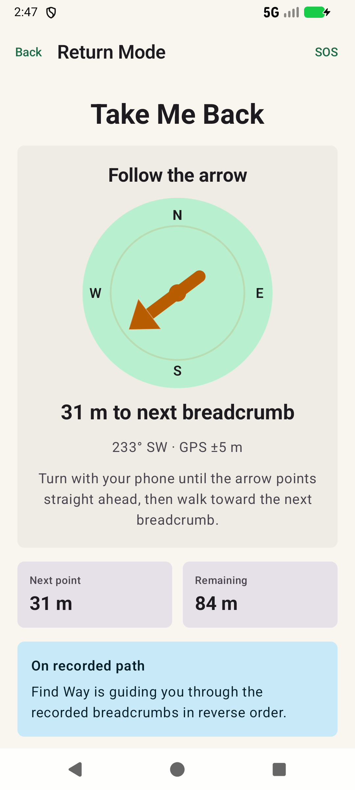

# Find Way

Find Way is an Android outdoor-safety app designed to help hikers, campers, travelers, and field workers retrace a recorded route when they lose their bearings.

The core product promise is simple:

> Start tracking before you go. If you get lost, follow your saved breadcrumbs back.

Find Way is intended to be an offline-first safety aid with a calm, readable interface that remains useful when connectivity is unavailable and the user is under stress.

## Screenshots

<table>
  <tr>
    <td align="center"><br /><strong>Home</strong></td>
    <td align="center"><br /><strong>Active tracking</strong></td>
    <td align="center"><br /><strong>Directional return</strong></td>
  </tr>
</table>

## Project Status

Find Way is currently a **functional Android MVP vertical slice**. The primary journey records real fused-location updates into Room, calculates route distance, persists completed trails, and guides the user back through recorded breadcrumbs using live compass heading.

Implemented:

- Native Android project using Kotlin and Jetpack Compose
- Material 3 outdoor-safety design system
- Single-activity, edge-to-edge application
- Type-safe, saveable Navigation 3 routes
- Home, Tracking, Return Mode, Saved Trails, Trail Detail, SOS, and Settings screens
- Runtime foreground location permission flow
- Device-backed readiness dashboard for permission, battery, and available storage
- Fused Location Provider updates in a `location` foreground service
- Ongoing recording notification with a stop action
- Room persistence for trails and ordered GPS breadcrumbs
- GPS accuracy and duplicate/inaccurate-point filtering
- Live route distance, elapsed time, breadcrumb count, and accuracy
- Data-driven breadcrumb visualization with start and current-position markers
- Sensor-driven compass arrow toward the next return breadcrumb
- Pure Kotlin return-progress calculation
- Persisted Saved Trails and Trail Detail screens
- Current-coordinate sharing and emergency dial intent
- Hilt dependency injection
- Unit and instrumented Compose tests
- Room database integration test
- Successful emulator journey using injected GPS coordinates

Not implemented yet:

- Real map or offline map rendering
- Starting return guidance from a previously completed trail
- User-configurable recording and alert settings
- Off-route vibration and sound alerts
- GPX import and export
- Physical-device field and battery testing
- Production emergency-service localization

The app does not insert demonstration trails or route metrics. Empty and waiting states remain visible until the device supplies GPS and sensor data.

## Verified Recording Journey

The current implementation was verified on an Android emulator by:

1. Granting precise foreground location and notification permissions.
2. Starting the location foreground service from Home.
3. Injecting changing GPS coordinates through the emulator.
4. Confirming accepted points, measured distance, elapsed time, and GPS accuracy on Tracking.
5. Confirming calculated bearing, next-point distance, and remaining distance in Return Mode.
6. Stopping recording and confirming the completed trail appeared in Saved Trails.

One verification run recorded four accepted breadcrumbs over 105 m. A second run produced the screenshots above from three accepted breadcrumbs over 83 m.

## Product Goals

1. Record a user's route as a sequence of reliable GPS breadcrumbs.
2. Continue recording while the screen is off through a visible foreground service.
3. Reverse the recorded route and guide the user toward the next breadcrumb.
4. Warn the user when they drift too far from the saved path.
5. Preserve the core tracking and return experience without internet access.
6. Communicate GPS accuracy, battery state, and safety limitations clearly.

Find Way is a navigation aid, not a replacement for emergency services, prepared route planning, physical maps, or sound outdoor judgment.

## Technology

- **Language:** Kotlin 2.3
- **UI:** Jetpack Compose with Material 3
- **Navigation:** Jetpack Navigation 3 with serializable `NavKey` routes
- **Architecture:** UI, domain, data, device, and location layers with unidirectional data flow
- **Asynchronous work:** Kotlin Coroutines and Flow
- **Build system:** Gradle 9.1 with Android Gradle Plugin 9
- **Android SDK:** compile/target SDK 36, minimum SDK 24
- **Java:** Java 17 source compatibility using JDK 21 toolchain
- **Testing:** JUnit 4 and Android Compose UI testing

Room, Hilt, Fused Location Provider, Android sensors, and a location foreground service are integrated. DataStore remains planned for future user settings.

## Current Navigation

```text
Home
|-- Tracking
|   |-- Return Mode
|   `-- SOS
|-- Saved Trails
|   `-- Trail Detail
|       `-- Return Mode
|-- SOS
`-- Settings
```

Navigation state uses `rememberNavBackStack`, allowing the back stack to survive configuration changes. Destinations are represented by typed, serializable navigation keys instead of route strings.

## Architecture Direction

```text
Compose Screen
    |
App ViewModel / Immutable UI State
    |
Domain Calculations and Filtering
    |
Repositories
    |
Room | Foreground Location Service | Sensors | Device Status
```

The application will follow these principles:

- A single source of truth for active and saved trails
- Immutable UI state exposed with `StateFlow`
- Lifecycle-aware state collection in Compose
- Platform APIs hidden behind interfaces and repositories
- Pure Kotlin route calculations where possible
- Fakes instead of mocks for most tests
- Foreground-only location permission plus a location foreground service for active tracking

## Project Structure

```text
app/src/main/java/com/example/findway/
|-- MainActivity.kt              # Single Android activity
|-- FindWayApplication.kt        # Hilt application entry point
|-- Navigation.kt                # Navigation 3 graph and destination wiring
|-- NavigationKeys.kt            # Typed navigation keys
|-- data/                         # Room repository and persistent entities
|-- device/                       # Battery and storage readiness state
|-- domain/
|   |-- TrailProgress.kt         # Breadcrumb return-progress logic
|   `-- BreadcrumbAcceptancePolicy.kt
|-- location/                     # Foreground recorder and compass heading
|-- theme/                       # Material 3 colors, typography, and theme
|-- ui/model/
|   |-- AppUiState.kt            # Device and repository-backed screen state
|   `-- TrailUiModels.kt         # Readiness and breadcrumb-map UI state
|-- ui/AppViewModel.kt           # State aggregation and recording actions
`-- ui/screens/
    `-- AppScreens.kt            # Compose screens and state rendering

app/src/test/                    # Local JVM unit tests
app/src/androidTest/             # Emulator/device Compose tests
```

The screen file will be separated into feature packages as the application grows beyond the current MVP scope.

## Getting Started

### Requirements

- Android Studio with JDK 21
- Android SDK 36
- An emulator or Android device running API 24 or newer

Clone the repository:

```bash
git clone https://github.com/himu-gupta/find-way.git
cd find-way
```

Open the project in Android Studio and allow Gradle sync to complete.

Build the debug APK:

```bash
./gradlew :app:assembleDebug
```

The APK is generated at:

```text
app/build/outputs/apk/debug/app-debug.apk
```

## Testing

Run local unit tests:

```bash
./gradlew :app:testDebugUnitTest
```

Run the build and local tests together:

```bash
./gradlew :app:assembleDebug :app:testDebugUnitTest
```

With an emulator or device running, execute instrumented Compose tests:

```bash
./gradlew :app:connectedDebugAndroidTest
```

Current coverage includes:

- Empty-route return behavior
- Selecting the previous breadcrumb from the end of a recorded route
- Off-route threshold detection
- Presence of the Home screen's readiness state and primary safety actions
- Presence of active tracking status, recorded-point count, breadcrumb route, and return action
- Breadcrumb accuracy and movement filtering
- Room persistence across active and completed trail states

## Development Roadmap

### Phase 1: Foundation

- [x] Compose project and theme
- [x] Navigation 3 app shell
- [x] Core state-driven screens
- [x] Initial unit and Compose tests
- [x] Hilt dependency injection
- [ ] Split screens into feature packages

### Phase 2: Trail Storage

- [x] Define trail and breadcrumb models
- [x] Add Room database and DAO
- [x] Add repository interface and Room implementation
- [x] Persist active and completed trails

### Phase 3: Location Recording

- [x] Add contextual foreground location permission requests
- [x] Integrate Fused Location Provider
- [x] Add a location foreground service and persistent notification
- [x] Filter inaccurate and redundant points
- [ ] Add battery-aware recording profiles

### Phase 4: Return Guidance

- [x] Connect active-trail return progress to live recorded location
- [x] Add sensor-backed compass and bearing guidance
- [x] Render the recorded route and current position
- [ ] Add off-route vibration and sound alerts
- [ ] Handle weak, approximate, and unavailable GPS states

### Phase 5: Safety and Release Readiness

- [ ] Implement coordinate sharing and emergency call intents
- [ ] Add GPX import/export
- [ ] Add accessibility and adaptive-layout testing
- [ ] Add database, service, navigation, and end-to-end tests
- [ ] Validate battery usage and long-running recording on physical devices
- [ ] Prepare privacy disclosures and Google Play foreground-service declarations

## Design Principles

- **One-glance guidance:** critical information must be readable while moving or stressed.
- **Offline first:** recording and retracing must not depend on connectivity.
- **Battery aware:** location accuracy should be balanced against trip duration.
- **Honest confidence:** surface GPS accuracy rather than implying false precision.
- **Large touch targets:** controls should remain usable outdoors and in difficult conditions.
- **No social clutter:** the product is a focused safety tool, not a fitness feed.

## License

No open-source license has been selected yet. Until a license is added, the source code remains under the repository owner's copyright.
